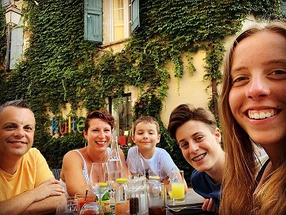

{: .shadow}{: .right :}{:.rounded}

My name is Bart Roels. 
I am a Partner Technology Strategist at Microsoft Belgium.
I am focusing on Microsoft technologies, especially cloud solutions based on Microsoft Azure, Azure Stack, ARM, Terraform, AKS, ...

I live in Belgium togheter with my wife Katrien and my son Joren. I am also a plus dad for Maren and Yentl.

{: .shadow}{: .center-block :}
